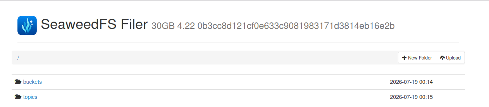

# Lab Information

Complete the xFusionCorp Industries fraud-detection production DVC pipeline. Three stages are already wired in dvc.yaml, two remain, and the pipeline must finish as a reproducible, SeaweedFS-backed, v1.0-tagged release.

A project exists at /root/code/ml-pipeline/ with Git and DVC initialised. The params.yaml is in place and the .dvc/config is pre-configured to push to the SeaweedFS bucket dvc-storage at http://localhost:8333.

The ingest, validate, and preprocess stages are already declared in dvc.yaml, but one of them is misconfigured and prevents dvc repro from completing — run dvc repro to see it fail. The two scripts for the remaining stages are pre-staged at /root/code/ml-pipeline/scripts-staging/train.py and scripts-staging/evaluate.py, and belong in scripts/.

Acceptance criteria:

    The misconfigured existing stage is corrected so dvc repro can complete.
    Two further stages are declared in dvc.yaml:
        train – Depends on the preprocessed dataset and scripts/train.py; reads n_estimators, max_depth, test_size, and random_seed from params.yaml; outputs models/model.pkl and data/processed/test_split.csv; declares metrics.json as a DVC metric with cache: false.
        evaluate – Depends on models/model.pkl, data/processed/test_split.csv, and scripts/evaluate.py; outputs reports/evaluation.json declared with cache: false.
    The full pipeline has been reproduced, the cache pushed to the SeaweedFS remote, and the current state tagged v1.0.
    Every change is committed to Git so the release is fully captured.

    Open the SeaweedFS Filer button at the top of the lab and navigate to /buckets/dvc-storage/ to confirm that the bucket holds the pushed artefacts under the files/md5/... layout.


---

# Lab Solutions

✅ Part 1: Lab Step-by-Step Guidelines


Step 1: Enter the project

```
cd /root/code/ml-pipeline
```

Step 2: Run the pipeline once

The lab tells you one stage is intentionally broken.

Run:

```
dvc repro
```
Don't fix anything yet.

Read the error carefully.

Examples:

Missing dependency
Output mismatch
Script not found
Wrong filename

The error will tell you exactly which existing stage is misconfigured.

Step 3: Inspect the existing pipeline

```
cat dvc.yaml
```

Output:

```
root@controlplane ml-pipeline on  main [?] ✖ cat dvc.yaml
stages:
  ingest:
    cmd: python3 scripts/ingest.py
    deps:
      - scripts/ingest.py
      - data/raw/data.csv

  validate:
    cmd: python3 scripts/validate.py
    deps:
      - data/raw/data.csv
      - scripts/validate.py
    outs:
      - reports/validation.json:
          cache: false

  preprocess:
    cmd: python3 scripts/preprocess.py
    deps:
      - data/raw/data.csv
      - scripts/preprocess.py
    outs:
      - data/processed/cleaned.csv
```


Step 4: Check what preprocess.py actually created

Run:

```
ls -l data/processed
```

Output:

```
root@controlplane ml-pipeline on  main [?] ➜  ls -l data/processed
total 4
-rw-r--r-- 1 root root 702 Jul 19 00:15 clean.csv
```

Step 5: Fix the preprocess output path.

Open dvc.yaml in the VS Code editor. In the preprocess stage, change the last line from:

      - data/processed/cleaned.csv

to:

      - data/processed/clean.csv

Save the file (Ctrl+S).


Step 6: Copy the remaining scripts into scripts/.


```
cp scripts-staging/train.py    scripts/train.py
cp scripts-staging/evaluate.py scripts/evaluate.py
```

Add the train and evaluate stages to dvc.yaml.

Step 7: Declare the train and evaluate stages with dvc stage add.


Train stage:

```
dvc stage add -n train \
  -d data/processed/clean.csv -d scripts/train.py \
  -p n_estimators,max_depth,test_size,random_seed \
  -o models/model.pkl -o data/processed/test_split.csv \
  -M metrics.json \
  python3 scripts/train.py
```

Evaluate stage:

```
dvc stage add -n evaluate \
  -d models/model.pkl -d data/processed/test_split.csv -d scripts/evaluate.py \
  -O reports/evaluation.json \
  python3 scripts/evaluate.py
```


Run:

```
dvc repro
```

Push to SeaweedFS:

```
dvc push
```

Commit everything:

```
git add .
git commit -m "Complete production DVC pipeline"
```
Tag the release:

```
git tag v1.0
```

Step 8: Verify the SeaweedFS bucket


---

🧠 Part 2: Simple Step-by-Step Explanation (Beginner Friendly)

In this lab, the ingest and validate stages completed successfully, but the pipeline stopped during the preprocess stage.

When you ran:

dvc repro

DVC executed the preprocess.py script successfully, and the script printed:

Preprocessed: 20 clean rows

However, DVC then displayed the following error:

ERROR: failed to reproduce 'preprocess':
output 'data/processed/cleaned.csv' does not exist

This tells us that the Python script itself did not fail. Instead, DVC could not find the output file that was defined in dvc.yaml.

To investigate, we opened the pipeline configuration:

cat dvc.yaml

Inside the preprocess stage, the output was configured as:

outs:
  - data/processed/cleaned.csv

Next, we checked the actual contents of the data/processed directory:

ls -l data/processed

The output showed:

clean.csv

This revealed the problem: the script created clean.csv, but dvc.yaml expected cleaned.csv.

Because DVC verifies that every declared output exists after a stage finishes, it stopped the pipeline when it couldn't find cleaned.csv.

To fix the issue, we updated the outs section of the preprocess stage so that it matched the file actually produced by the script:

preprocess:
  cmd: python3 scripts/preprocess.py
  deps:
    - data/raw/data.csv
    - scripts/preprocess.py
  outs:
    - data/processed/clean.csv

After saving the change, running:

dvc repro

again allows DVC to locate the correct output file and continue executing the remaining stages of the pipeline.

Key Takeaway

A very common DVC error is:

output '<filename>' does not exist

When you see this message, the first thing to check is whether the output filename in dvc.yaml exactly matches the filename created by the script. Even a small difference—such as clean.csv versus cleaned.csv—is enough to cause the pipeline to fail. Always verify the actual output file (for example, using ls) before updating the pipeline configuration.

---