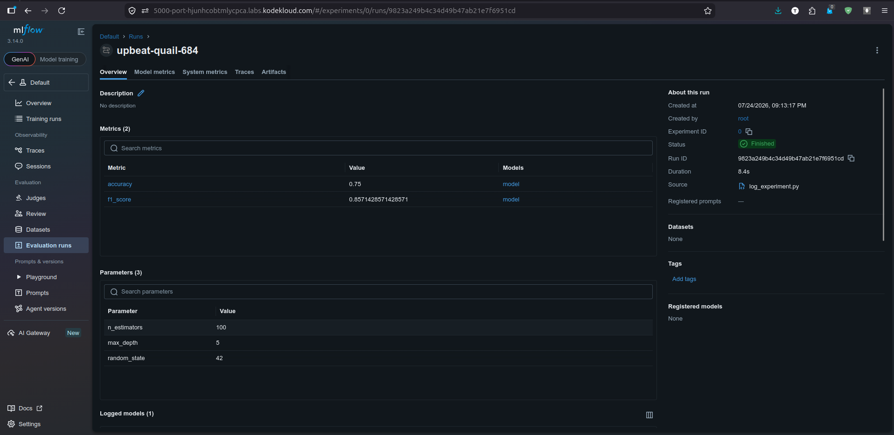

# Lab Information

A data scientist at xFusionCorp Industries requires a training run to be recorded in MLflow in order to establish a baseline record on the tracking dashboard. The essential non-MLflow scaffolding has already been implemented in the script located at /root/code/log_experiment.py. Your objective is to complete the script by filling in the TODO blocks with the appropriate MLflow logging calls, ensuring that every aspect of the run is effectively captured by the MLflow tracking server.

    The MLflow tracking server is already running on port 5000. The MLflow UI button at the top of the lab can be opened to view the dashboard; the Default experiment is present on first load.

    The script at /root/code/log_experiment.py prepares a params dictionary, fits a trivial sklearn model, and computes a pair of evaluation scores (accuracy and f1) from that model's predictions. Three blocks marked # TODO inside the mlflow.start_run() context are the only edits required.

    Once the TODOs are completed and the script has been run, the end state must include:
        A new run in the Default experiment.
        Every hyperparameter in the params dict (n_estimators=100, max_depth=5, random_state=42) recorded as a run parameter.
        Both computed scores (accuracy, f1_score) recorded as run metrics.
        The sklearn model captured as an MLflow model artefact on the run.

    The result can be confirmed in the MLflow UI—once the run is opened, the Parameters, Metrics, and Artifacts panels each show the expected content.


---

# Lab Solutions

✅ Part 1: Lab Step-by-Step Guidelines

This lab only requires you to fill in the three # TODO blocks inside the with mlflow.start_run(): section. Do not modify any other part of the script.

Step 1: Open the project

```
cd /root/code
```

Open the script:

```
nano log_experiment.py
```

or

```
vi log_experiment.py
```

Step 2: Locate the TODO blocks

You'll see something similar to:

with mlflow.start_run():

    # TODO

    # TODO

    # TODO

Step 3: Log the parameters

Replace the first TODO with:

mlflow.log_params(params)

This logs every parameter in the dictionary:

n_estimators
max_depth
random_state

Step 4: Log the metrics

Replace the second TODO with:

mlflow.log_metric("accuracy", accuracy)
mlflow.log_metric("f1_score", f1)

This records:

accuracy
f1_score

Step 5: Log the model

Replace the third TODO with:

mlflow.sklearn.log_model(model, "model")

This uploads the trained sklearn model as an MLflow artifact.

Step 6: Save the file

Save and exit.

Step 7: Run the script

Execute:

python3 log_experiment.py

Expected output:

Run completed successfully

(or similar depending on the lab.)

Step 8: Verify in MLflow UI

Click the MLflow UI button.

Open the Default experiment.

You should now see one new run.

Open that run and verify:

Parameters
n_estimators = 100
max_depth = 5
random_state = 42

Metrics
accuracy
f1_score

Artifacts
model/



---


🧠 Part 2: Simple Step-by-Step Explanation (Beginner Friendly)

This lab teaches you how to record a machine learning experiment using MLflow.

The script already does most of the work:

It creates a dictionary of hyperparameters.
It trains a simple scikit-learn model.
It calculates two evaluation metrics:
Accuracy
F1 Score

Your job is simply to tell MLflow what information should be saved.

Why do we log the parameters?

The script contains a dictionary like:

params = {
    "n_estimators": 100,
    "max_depth": 5,
    "random_state": 42
}

Running:

mlflow.log_params(params)

stores every key-value pair as run parameters.

Later, anyone viewing the MLflow UI can immediately see which hyperparameters were used for that training run.

Why do we log the metrics?

After the model is trained, the script calculates two performance scores:

Accuracy
F1 Score

Using:

mlflow.log_metric("accuracy", accuracy)
mlflow.log_metric("f1_score", f1)

records these values so they appear in the Metrics section of the MLflow UI.

This makes it easy to compare different training runs and identify which model performs best.

Why do we log the model?

The trained machine learning model exists only in memory after training.

Running:

mlflow.sklearn.log_model(model, "model")

saves the model as an MLflow artifact.

This means the model can later be downloaded, loaded back into Python, or deployed without retraining it.

---