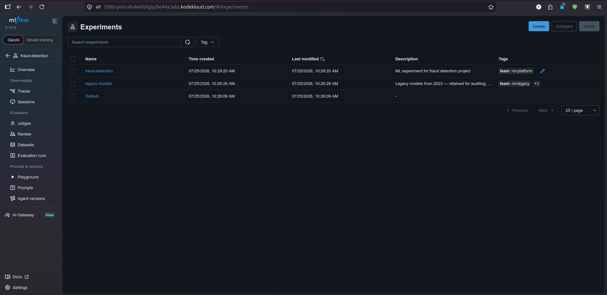
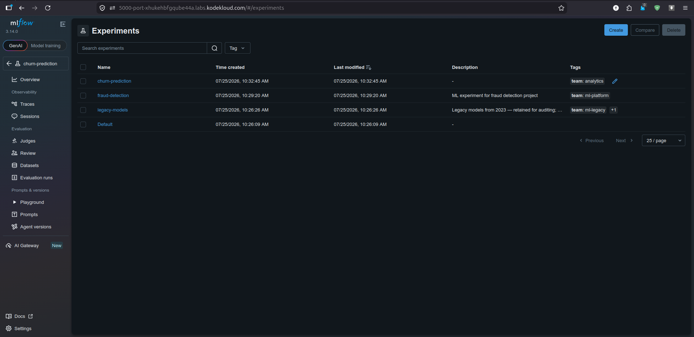

# Lab Information

You are tasked with onboarding two new ML projects for the xFusionCorp Industries ML platform team. It is essential that each project is organized under its own MLflow experiment, rather than sharing the Default experiment. Proceed to register both experiments using the MLflow UI, ensuring that they are correctly tagged with the owning team.

    The MLflow tracking server is already running on port 5000. The MLflow UI button at the top of the lab can be opened to view the dashboard. One seeded experiment (legacy-models) is listed alongside the platform-created Default—both act as reference material and must not be modified.

    Using the MLflow UI, register two new experiments with the experiment-level metadata below. The task is complete when both records satisfy every bullet.

        fraud-detection
            Experiment-level description is a non-empty string describing the project (any phrasing).
            Experiment-level tag: key team, value ml-platform.

        churn-prediction
            Experiment-level tag: key team, value analytics.

    The result can be confirmed in the MLflow UI: both new experiments appear in the left-hand list, with the description and tags visible on each experiment's page.

---

# Lab Solutions

✅ Part 1: Lab Step-by-Step Guidelines

This lab is completed entirely through the MLflow UI. No terminal commands or Python code are required.

Step 1: Open the MLflow UI

Click the MLflow UI button at the top of the lab.

You should see two existing experiments:

Default
legacy-models

Do not modify either of these experiments.

Step 2: Create the fraud-detection experiment

Click Create Experiment (or + Create depending on the MLflow version).
Fill in the fields:

Field	    Value
Name	    fraud-detection
Description	ML experiment for fraud detection project. (Any non-empty description is acceptable.)

Under Tags, add:
Key	    Value
team	ml-platform
Click Create.

Step 3: Verify fraud-detection

Open the newly created experiment.

Confirm:

✅ Name: fraud-detection
✅ Description is not empty
✅ Tag:
team = ml-platform

Step 4: Create the churn-prediction experiment

Again, click Create Experiment.

Fill in:

Field	Value
Name	churn-prediction

A description is not required by the lab, but adding one is fine if the UI requests it.

Add the tag:

Key	    Value
team	analytics

Click Create.

Step 5: Verify churn-prediction

Open the experiment.

Confirm:

✅ Name: churn-prediction
✅ Tag:
team = analytics

Step 6: Final Verification

The left-hand panel should now contain four experiments:

Default
legacy-models
fraud-detection
churn-prediction

Verify:

fraud-detection
Description is present.
Tag:
team = ml-platform

churn-prediction
Tag:
team = analytics

Once these are visible, the lab requirements are satisfied.

---

🧠 Part 2: Simple Step-by-Step Explanation (Beginner Friendly)

In MLflow, an experiment is a container that groups related training runs.

Instead of placing every machine learning project into the Default experiment, teams typically create a separate experiment for each project.

For example:

Default
├── Test runs

fraud-detection
├── Fraud model v1
├── Fraud model v2
└── Fraud model v3

churn-prediction
├── Churn model v1
└── Churn model v2

This keeps projects organized and makes it easier to compare runs within the same project.

Why add a description?

The description explains the purpose of the experiment.

For this lab, the fraud-detection experiment must have any non-empty description, such as:

"ML experiment for fraud detection."

The exact wording does not matter as long as it is not empty.

Why add tags?

Tags store metadata about an experiment.

In this lab, the tag identifies the team responsible for each project.

For fraud-detection:

Key	Value
team	ml-platform

For churn-prediction:

Key	Value
team	analytics

These tags make it easy to filter or identify experiments by ownership.

---