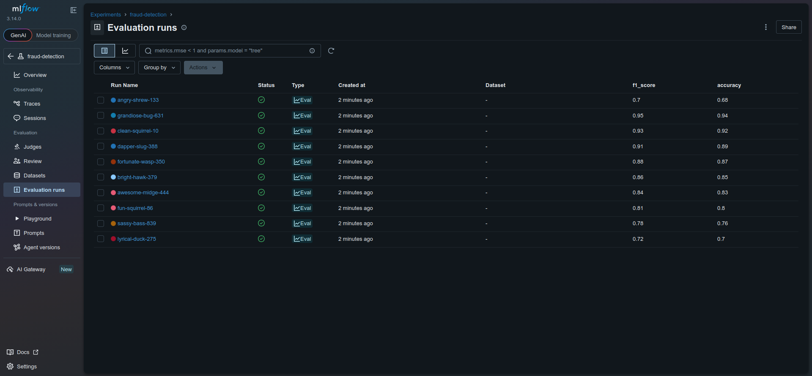
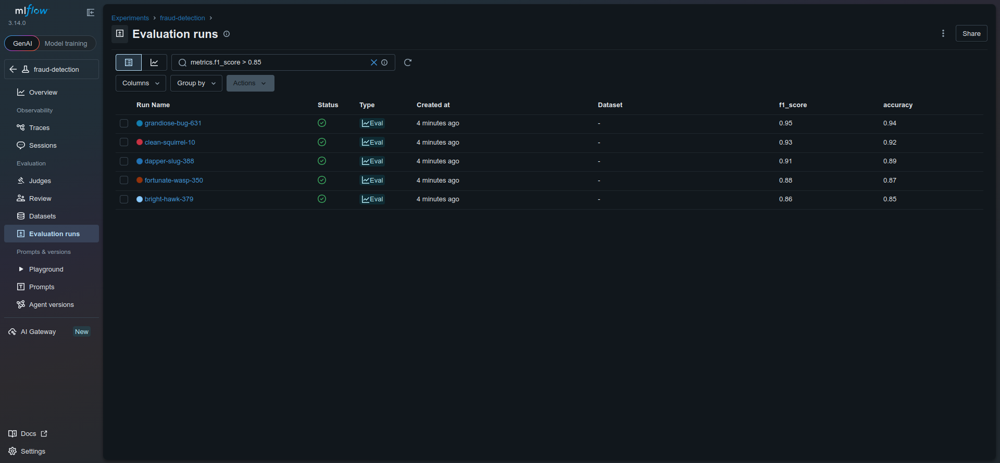
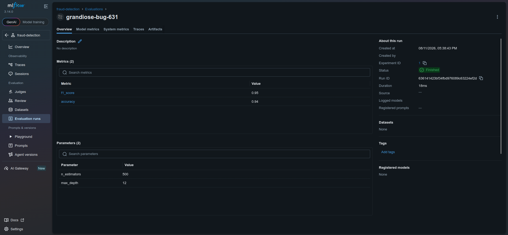
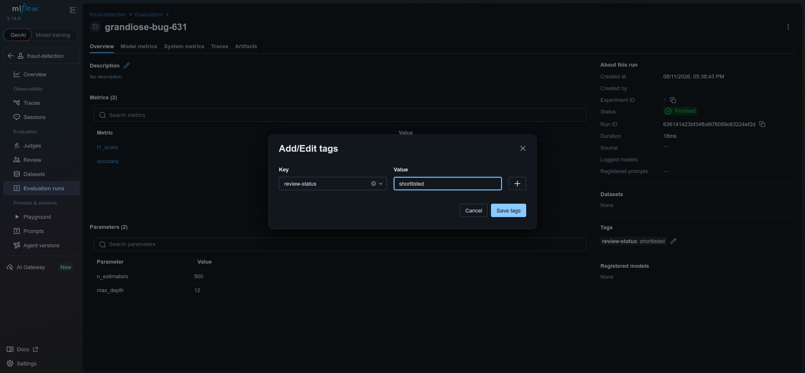
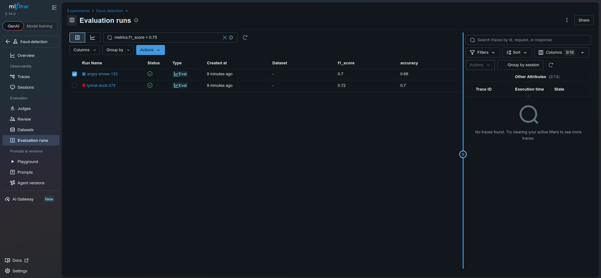
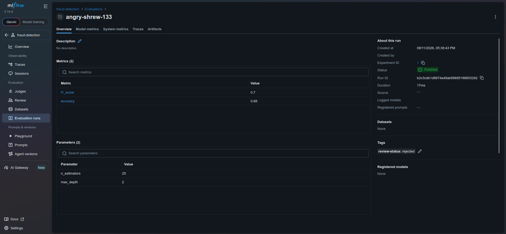

# Lab Information

A data scientist at xFusionCorp Industries has completed ten runs in the fraud-detection MLflow experiment. Your objective is to triage these runs within the MLflow UI. Begin by utilizing the search functionality to narrow down the results. Subsequently, compare the candidates side by side and identify the single best candidate to tag as shortlisted. Additionally, flag any runs that are clearly underperforming for removal.

    The MLflow tracking server is already running on port 5000, and the fraud-detection experiment has been pre-populated with ten runs (each carrying n_estimators, max_depth, accuracy, and f1_score). The runs can be viewed via the MLflow UI button → fraud-detection experiment.

    Work through the MLflow UI's Search bar (to filter runs with the metrics.* query syntax) and its Compare view (to inspect the contenders side by side) to reach the triage end state below. The end state is what is tested—the path taken through the UI is not.

        Shortlist the best candidate. Among all runs where metrics.f1_score > 0.85, the single run with the highest f1_score must carry a run-level tag: key review-status, value shortlisted.

        Reject the under-performers. Every run where metrics.f1_score < 0.75 must carry a run-level tag: key review-status, value rejected.

    The other runs (those in the 0.75 ≤ f1 ≤ 0.85 band, and the second-best shortlisting candidate) must carry no review-status tag at all.

---

# Lab Solutions

✅ Part 1: Lab Step-by-Step Guidelines

This lab is UI-only. You need to use MLflow's Search and Compare features, then apply the correct review-status tags.

The important part is that the validator checks the final tags, not necessarily how you reached them.

Step 1: Open MLflow

Click the MLflow UI button at the top of the lab.

Then:

Open the fraud-detection experiment.
You should see 10 runs.

Each run has:

n_estimators
max_depth
accuracy
f1_score

Step 2: Find the high-performing candidates

Use the Search bar.

Enter:

metrics.f1_score > 0.85

This filters the runs to only those with:

f1_score > 0.85

These are your shortlisting candidates.

Step 3: Compare the candidates

Select the filtered runs and click Compare.

Look at:

f1_score

Find the run with the highest f1_score.

For example, if you had:

Run A    0.87
Run B    0.91
Run C    0.89

then:

Run B → 0.91

is the single best candidate.

Do not shortlist every run above 0.85. Only the one with the highest f1_score gets shortlisted.

Step 4: Tag the best run as shortlisted

Open the best-performing run.

Find the Tags section and add:

Key	            Value
review-status	shortlisted

Save the tag.

Step 5: Find the under-performing runs

Return to the Search bar.

Search:

metrics.f1_score < 0.75

This shows every run that must be rejected.

Step 6: Tag every under-performing run

For every run returned by:

metrics.f1_score < 0.75

add this run-level tag:

Key	            Value
review-status	rejected

If there are 3 runs below 0.75, all 3 must receive the rejected tag.

Step 7: Check the middle band

The lab specifically says runs in this range must have no review-status tag:

0.75 ≤ f1_score ≤ 0.85

So don't tag these runs.

Also, if there are multiple runs above 0.85, only the highest-scoring one should be shortlisted.

The second-best high-performing run must have no review-status tag.

---

🧠 Part 2: Simple Step-by-Step Explanation (Beginner Friendly)

Think of this lab as a model-review process.

You have 10 trained models, and you need to classify them into three groups.

🟢 Best model

The best model is:

f1_score > 0.85

and has the highest f1_score among all those models.

It gets:

review-status = shortlisted

There must be exactly one shortlisted run.

🔴 Poor models

Any model with:

f1_score < 0.75

is considered an under-performer.

Every one of these gets:

review-status = rejected

For example:

Run 1 → 0.71 → rejected
Run 2 → 0.68 → rejected
Run 3 → 0.73 → rejected
⚪ Middle-performing models

Models with:

0.75 ≤ f1_score ≤ 0.85

don't receive any review-status tag.

For example:

0.75 → no tag
0.78 → no tag
0.82 → no tag
0.85 → no tag
What about the second-best high performer?

Suppose your results are:

Run A → 0.94
Run B → 0.91
Run C → 0.88
Run D → 0.82
Run E → 0.76
Run F → 0.73

The correct result is:

Run	f1_score	review-status
Run A	0.94	shortlisted
Run B	0.91	No tag
Run C	0.88	No tag
Run D	0.82	No tag
Run E	0.76	No tag
Run F	0.73	rejected

The key distinction is:

> 0.85 identifies candidates, but only the highest candidate gets shortlisted.

🔎 The two searches you need

First:

metrics.f1_score > 0.85

→ Compare candidates → highest score → shortlisted

Then:

metrics.f1_score < 0.75

→ Tag every returned run → rejected

Finally, make sure all remaining runs have no review-status tag.

---