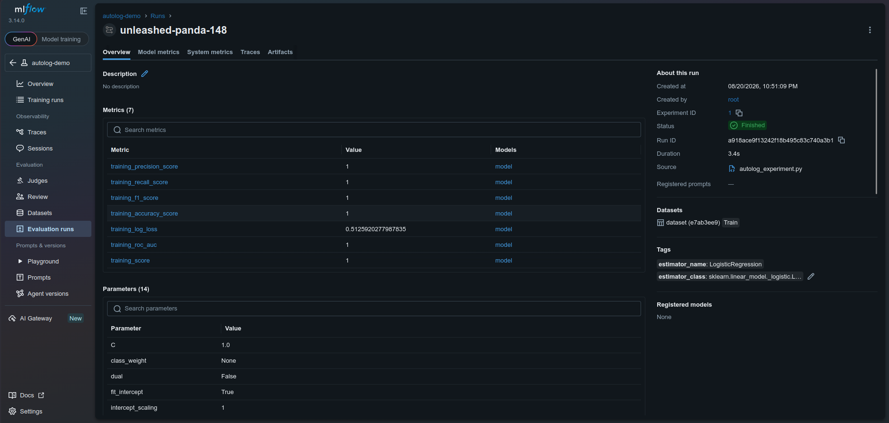

# Lab Information

The xFusionCorp Industries ML team intends to enhance their training scripts by replacing the manual log_param and log_metric boilerplate code with MLflow's autologging feature. This integration will ensure that every training run automatically captures its constructor parameters, training metrics, and model artifacts. A training scaffold has been prepared and is located at /root/code/autolog_experiment.py. This scaffold configures MLflow, fits a small synthetic sklearn model, and prints a confirmation message. There are two # TODO blocks that require completion. Your task is to successfully fill in these blocks to achieve the desired end state as specified.

    The MLflow tracking server is already running on port 5000. The MLflow UI button at the top of the lab can be opened to view the dashboard; only the Default experiment is present on first load.

    The scaffold at /root/code/autolog_experiment.py carries two # TODO blocks (each a one-line addition). Once they are completed and the script has been run, the following end state holds:
        An experiment named autolog-demo exists on the MLflow server.
        At least one run exists in the autolog-demo experiment.
        The run's Parameters panel lists every sklearn constructor parameter that the LogisticRegression in the scaffold implicitly carries (for example C, max_iter, solver, tol, penalty) – Not only the three explicit keyword arguments the scaffold passes.
        The Artifacts panel on the run contains a model directory with an MLmodel descriptor and a pickled estimator.

    No real dataset is loaded by the scaffold—the training step is a deterministic toy that gives MLflow a .fit() call to observe. The focus of the lab is autolog configuration, not model quality.


# Lab Solutions

✅ Part 1: Lab Step-by-Step Guidelines

This lab demonstrates MLflow Autologging. Instead of manually calling mlflow.log_param(), mlflow.log_metric(), and mlflow.sklearn.log_model(), MLflow automatically records them during model training.

The scaffold already trains a LogisticRegression model. Replace the two # TODO lines with:

```python
mlflow.set_experiment("autolog-demo")
mlflow.sklearn.autolog()
```

Step 1: Open the project

```
cd /root/code
```

Open the script:

nano autolog_experiment.py

or

vi autolog_experiment.py

Step 2: Find the two TODO blocks

You'll see two lines similar to:

# TODO

inside the script.

Step 3: Set the experiment

Replace the first TODO with:

```
mlflow.set_experiment("autolog-demo")
```

This creates the experiment (if it doesn't already exist) and tells MLflow to log runs into autolog-demo instead of Default.

Step 4: Enable MLflow Autologging

Replace the second TODO with:

```
mlflow.sklearn.autolog()
```

This enables automatic logging for scikit-learn models.

Step 5: Save the file

Save your changes and exit the editor.

Step 6: Run the script

Execute:

python3 autolog_experiment.py

The script should complete successfully and print its confirmation message.

Step 7: Open the MLflow UI

Click the MLflow UI button.

Verify that a new experiment named:

autolog-demo

has been created.

Step 8: Open the run

Inside the autolog-demo experiment, open the generated run.

Verify the following:

Parameters

You should see many parameters automatically logged, including defaults such as:

C
max_iter
solver
tol
penalty

along with any explicitly specified constructor arguments.

Artifacts

Open the Artifacts section.

You should see a directory similar to:

model/

Inside it, you'll find files such as:

MLmodel
model.pkl

(or an equivalent pickled estimator file, depending on the MLflow version).



---

🧠 Part 2: Simple Step-by-Step Explanation (Beginner Friendly)

In previous labs, you manually logged information to MLflow using functions like:

mlflow.log_params(...)
mlflow.log_metric(...)
mlflow.sklearn.log_model(...)

This works, but it becomes repetitive because every training script needs the same logging code.

MLflow Autologging removes that repetition.

When you enable:

mlflow.sklearn.autolog()

MLflow watches the scikit-learn model during its fit() call. As the model trains, MLflow automatically records:

the model's constructor parameters,
training information,
evaluation metrics (when supported),
and the trained model itself as an artifact.

One advantage of autologging is that it captures all constructor parameters—not just the ones you explicitly provide. For example, even if the script only specifies three arguments when creating LogisticRegression, MLflow also records default values such as C, solver, tol, and penalty. This creates a much more complete record of how the model was configured.

The other required change is:

mlflow.set_experiment("autolog-demo")

Without this line, the run would be logged to the Default experiment. By setting the experiment first, MLflow creates (if necessary) and uses a dedicated autolog-demo experiment, keeping runs for this project organized separately.

---
