# Lab Information

The xFusionCorp Industries ML platform team requires the promotion of two trained candidates using the MLflow Model Registry. This will enable the operations team to monitor which model version is currently serving production traffic effectively. Both runs are already available in the fraud-detection experiment. Your task is to register both runs as versions of a new fraud-detector model, provide a model-level description, and assign the aliases challenger and champion, utilizing the MLflow UI.

    The MLflow tracking server is already running on port 5000 and two runs are pre-populated in the fraud-detection experiment: a baseline run (n_estimators=100, max_depth=5, f1_score=0.80) and an improved run (n_estimators=200, max_depth=10, f1_score=0.89). Both runs can be opened via the MLflow UI button → fraud-detection experiment.

    Using the MLflow UI, reach the end state below. The order (baseline first, improved second) matters because MLflow assigns version numbers sequentially within a registered model.
        A registered model named fraud-detector exists in the Model Registry.
        The registered model carries a non-empty description that references the word fraud (any phrasing; for example Fraud detection model for xFusionCorp transactions).
        Version 1 of fraud-detector is the baseline run and carries the alias challenger.
        Version 2 of fraud-detector is the improved run and carries the alias champion.

---

# Lab Solutions

✅ Part 1: Lab Step-by-Step Guidelines

This lab is about the MLflow Model Registry. You need to register the two existing runs in the correct order because MLflow assigns model versions sequentially.

The required final state is:

fraud-detector
│
├── Version 1 → baseline  → alias: challenger
└── Version 2 → improved  → alias: champion

Step 1: Open MLflow

Click the MLflow UI button at the top of the lab.

Open:

fraud-detection

You should find two existing runs:

Baseline
run: baseline
n_estimators = 100
max_depth = 5
f1_score = 0.80
Improved
run: improved
n_estimators = 200
max_depth = 10
f1_score = 0.89

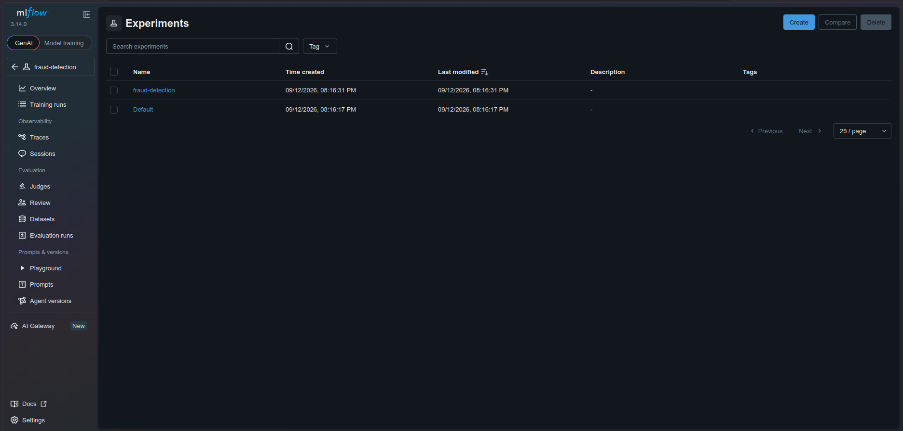

Step 2: Register the baseline run FIRST

Open the baseline run.

Find the model artifact under Artifacts.

You should see the logged model, typically something like:

model/

Open the model artifact and use the option to Register Model.

When prompted for the registered model name, enter:

fraud-detector

Create/register the model.

Important

Do this with baseline first.

MLflow will therefore assign:

fraud-detector
Version 1

to the baseline model.

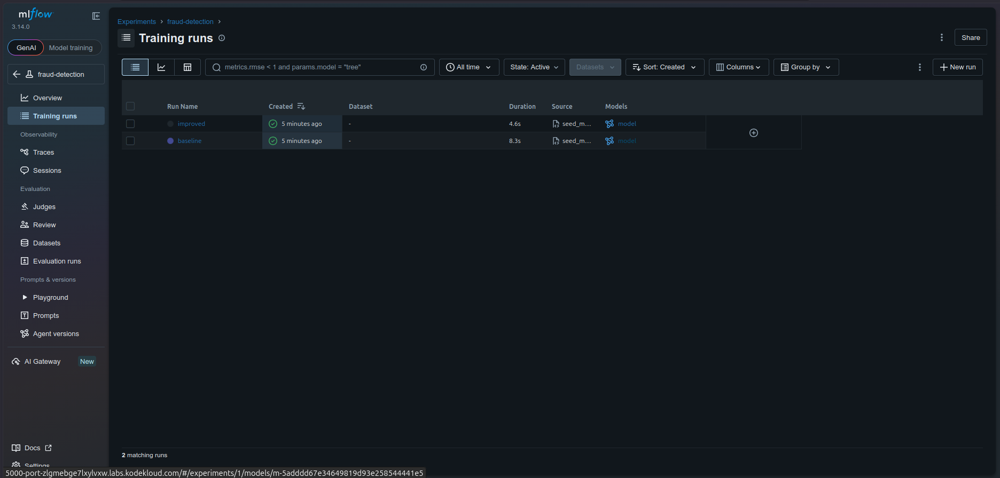

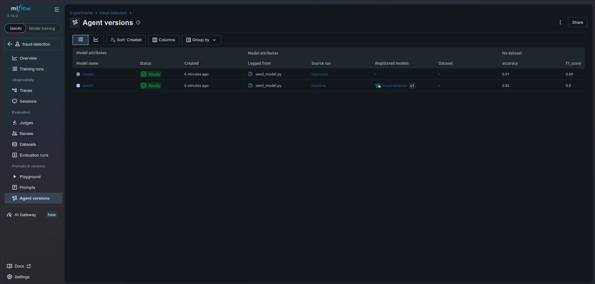

Step 3: Register the improved run SECOND

Go back to:

fraud-detection

Open the improved run.

Again, find its model artifact:

model/

Choose Register Model.

Select the existing registered model:

fraud-detector

Do not create another registered model.

This should create:

fraud-detector
Version 2

Version 2 should correspond to the improved run.

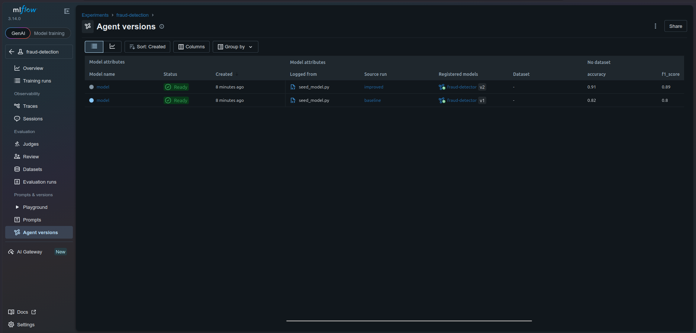

Step 4: Open the Model Registry

Navigate to the Models / Model Registry section of MLflow.

Open:

fraud-detector

You should now have:

Version 1
Version 2

Verify the source runs:

Version	Run	Parameters	F1
1	baseline	100 / 5	0.80
2	improved	200 / 10	0.89

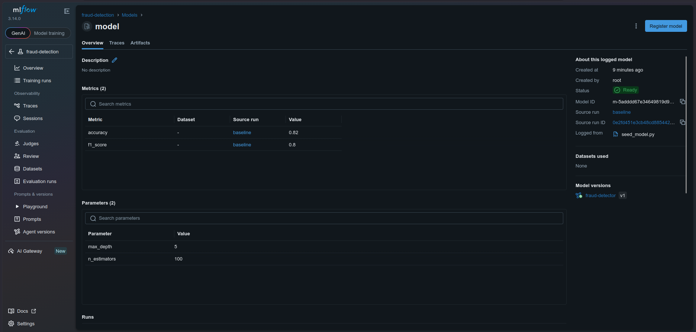

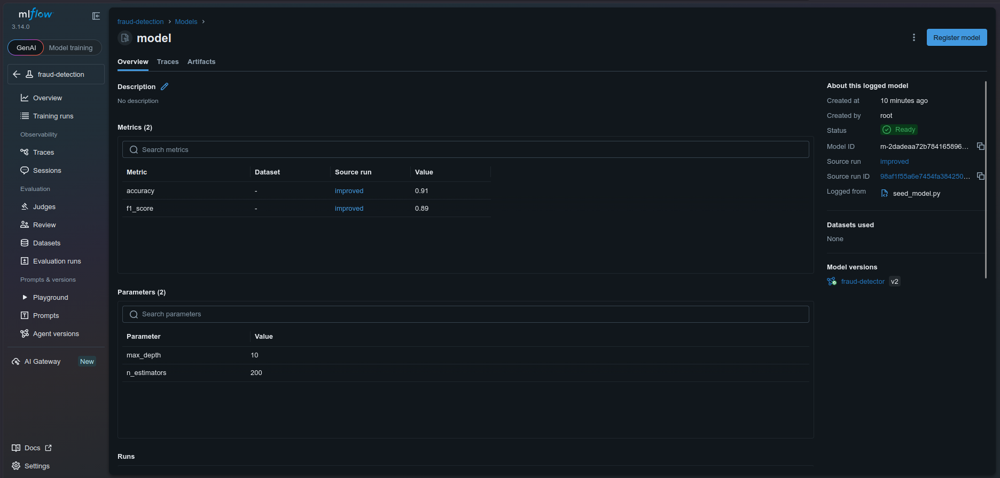

Step 5: Add the model description

On the fraud-detector registered model page, edit the model description.

Use:

Fraud detection model for xFusionCorp transactions

The important requirements are:

Description must not be empty.
It must contain the word fraud.

Save the description.

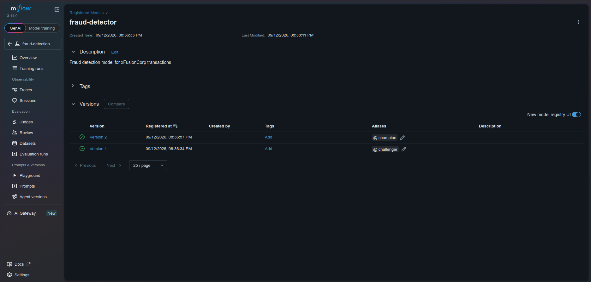

Step 6: Add the challenger alias to Version 1

Open Version 1.

Version 1 should be the baseline run.

Find the Aliases section and add:

challenger

Save it.

The result should be:

Version 1
Run: baseline
Alias: challenger

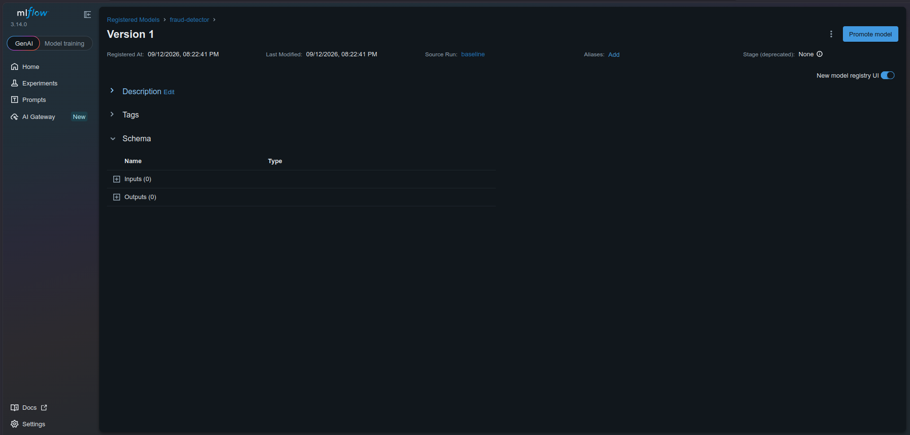

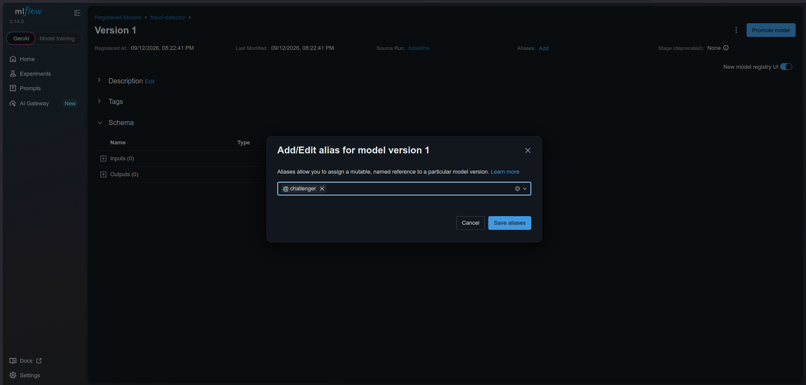

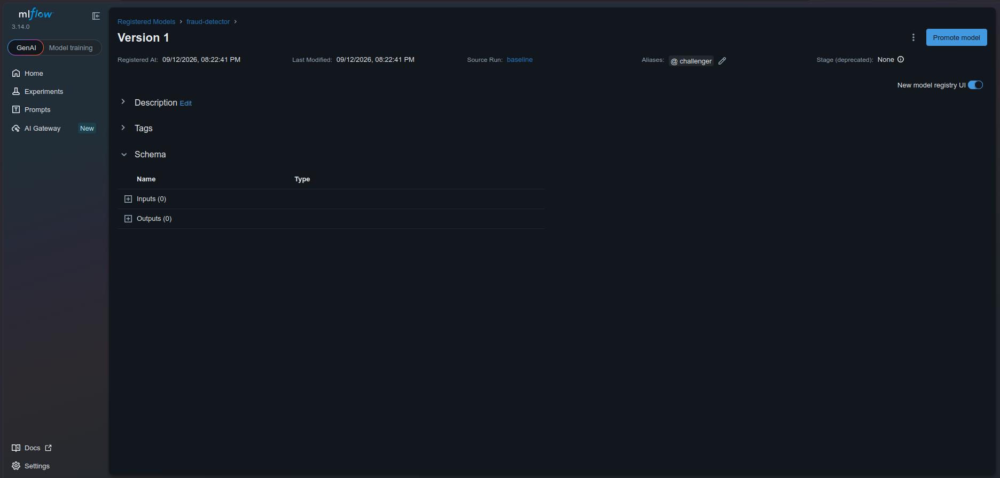

Step 7: Add the champion alias to Version 2

Open Version 2.

Version 2 should be the improved run.

Add the alias:

champion

Save it.

The result should be:

Version 2
Run: improved
Alias: champion

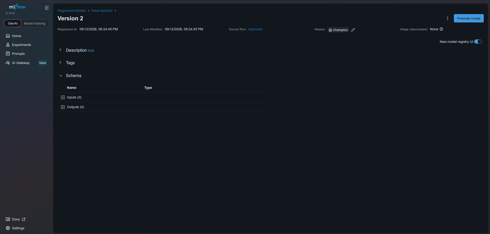

Step 8: Final verification

Your Model Registry should effectively look like:

fraud-detector
│
├── Description:
│   Fraud detection model for xFusionCorp transactions
│
├── Version 1
│   ├── Source: baseline
│   └── Alias: challenger
│
└── Version 2
    ├── Source: improved
    └── Alias: champion

⚠️ Critical ordering

Do not register improved first.

If you register improved first, MLflow will make it Version 1:

Version 1 → improved
Version 2 → baseline

and the lab will fail.

The correct sequence is:

baseline → Register → Version 1
       ↓
improved → Register → Version 2

---

🧠 Part 2: Simple Step-by-Step Explanation

What is the Model Registry?

The MLflow Model Registry provides a central place to manage models that have been trained and logged through MLflow.

Instead of simply having:

Run → model artifact

you create a managed model:

fraud-detector

which can contain multiple versions:

fraud-detector
├── Version 1
├── Version 2
├── Version 3
└── ...

Why are there two versions?

The data scientist has two models.

Baseline
n_estimators = 100
max_depth = 5
f1_score = 0.80

This becomes:

Version 1

and receives the alias:

challenger
Improved
n_estimators = 200
max_depth = 10
f1_score = 0.89

This becomes:

Version 2

and receives:

champion

The improved model has the better F1 score, so it is designated the current champion.

What are aliases?

An alias is a human-readable pointer to a model version.

Instead of operations having to remember:

fraud-detector Version 2

they can refer to:

fraud-detector@champion

Similarly:

fraud-detector@challenger

points to Version 1.

Conceptually:

fraud-detector
       │
       ├── challenger ──→ Version 1 ──→ baseline
       │
       └── champion ────→ Version 2 ──→ improved

This is useful because the alias can later be moved to another version without changing the model name.

