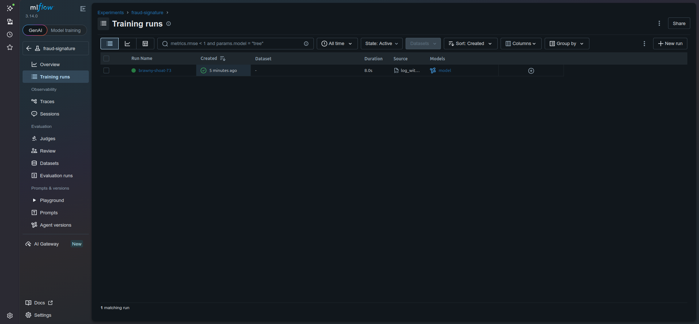

# Lab Information

The xFusionCorp Industries deployment team requires that every model promoted to serving includes an input schema to ensure that malformed requests are rejected at the boundary, preventing the occurrence of silent errors. A logging script along with the necessary data and model has been pre-staged. Your task is to attach an MLflow model signature and an input example during the model logging process.

    The MLflow tracking server is already running on port 5000. The MLflow UI button at the top of the lab can be opened to view the dashboard.

    The script /root/code/log_with_signature.py builds a small synthetic two-column training frame (amount, num_txn), fits a model, and computes its predictions — all already written. Attaching a signature is inherently a code step (there is no UI control for it), so the work is in the script. Two # TODO blocks remain inside the mlflow.start_run() context:
        TODO 1: Infer the model signature from the training inputs X and the model's predictions preds, and bind it to signature.
        TODO 2: Log the sklearn model under the artefact name model with the inferred signature and an input_example (pass X), so the logged model carries an enforced input schema.

    Once both TODOs are completed and the script has been run, the end state must include:
        An experiment named fraud-signature with at least one run.
        The logged model carries a signature whose input schema is exactly the columns amount and num_txn.
        The schema is enforced: loading the model and predicting with a frame that omits a required column (e.g. num_txn) is rejected, while a correctly-shaped frame predicts successfully.

---

# Lab Solutions

✅ Part 1: Lab Step-by-Step Guidelines

This lab requires two code changes only inside /root/code/log_with_signature.py.

The key MLflow functions are:

mlflow.models.infer_signature() → infer the schema from X and preds.
mlflow.sklearn.log_model() → log the model with the signature and input_example.

Step 1: Open the script

cd /root/code

Open the file:

nano log_with_signature.py

Step 2: Find the two TODO blocks

Inside the mlflow.start_run() block, you'll have something similar to:

with mlflow.start_run():

    # TODO 1

    # TODO 2

Do not change the existing training code.

Step 3: Complete TODO 1 — Infer the signature

Replace TODO 1 with:

signature = mlflow.models.infer_signature(X, preds)

This tells MLflow:

"Infer the expected input schema from X and the model output schema from preds."

The resulting input schema should contain exactly:

amount
num_txn

Step 4: Complete TODO 2 — Log the model with the signature

Replace TODO 2 with:

mlflow.sklearn.log_model(
    model,
    "model",
    signature=signature,
    input_example=X
)

This is important because we are not merely logging the model.

We are attaching:

the model
the input signature
an input example

to the MLflow model artifact.

Step 5: Save the script

Save and exit nano:

Ctrl+O
Enter
Ctrl+X

Step 6: Run the script

Execute:

python3 /root/code/log_with_signature.py

The script should complete successfully.

Step 7: Open MLflow UI

Click the MLflow UI button at the top of the lab.

Find the experiment:

fraud-signature

Open the newly created run.

Step 8: Verify the model signature

Open the logged:

model

Look for the model's Signature.

The input schema should contain exactly:

amount
num_txn

Conceptually:

Inputs
├── amount
└── num_txn

The model should also have an input example based on X.

Step 9: Verify schema enforcement

The lab specifically requires that the schema actually rejects malformed input.

You can test this from Python.

First locate the model URI from the MLflow UI or use the run's model artifact URI.

The important behavior is:

Correct input
import pandas as pd
import mlflow

model = mlflow.sklearn.load_model("MODEL_URI")

X_correct = pd.DataFrame({
    "amount": [100.0],
    "num_txn": [5]
})

predictions = model.predict(X_correct)

print(predictions)

This should succeed.

Incorrect input

For example, omit num_txn:

X_invalid = pd.DataFrame({
    "amount": [100.0]
})

model.predict(X_invalid)

This should be rejected because num_txn is required by the model signature.

🧠 Part 2: Simple Step-by-Step Explanation
1. What is a model signature?

A model signature describes the expected:

input
output

of an MLflow model.

In this lab, the model expects two input columns:

amount
num_txn

So the signature essentially tells MLflow:

Input:
    amount
    num_txn

Output:
    prediction
2. Why use infer_signature()?

Instead of manually writing the schema, MLflow can inspect the actual training input and model output.

This:

signature = mlflow.models.infer_signature(X, preds)

uses:

X

as the example input and:

preds

as the example output.

MLflow then generates the signature automatically.

3. Why pass X as input_example?

This:

input_example=X

provides MLflow with an example of the data required by the model.

It helps users understand how to call the model and is also stored as part of the model metadata.

4. Why is the signature important?

Without a signature, you could potentially send malformed input to the model.

For example:

amount

instead of:

amount
num_txn

The deployment team wants malformed requests rejected at the model boundary.

With the signature:

              Request
                 │
                 ▼
       ┌──────────────────┐
       │ Signature Check  │
       └────────┬─────────┘
                │
       ┌────────┴─────────┐
       │                  │
    Valid               Invalid
       │                  │
       ▼                  ▼
    Model              Reject
   predict()

A correctly shaped request containing both required columns can proceed to prediction.

A request missing num_txn should be rejected.